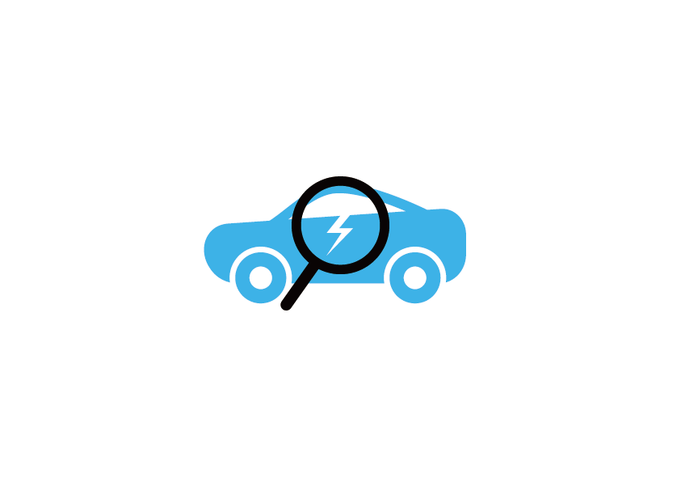

<p align="center">
  
</p>

<h1 align="center">카더라</h1>

<p align="center">
  <b>AI 기반 차량 손상 분석 & 수리 견적 플랫폼</b><br/>
  <sub>사진 한 장으로 시작하는 투명한 수리 견적 — 정보의 비대칭을 해소합니다</sub>
</p>

<p align="center">
  
  
  
  
  
</p>

<p align="center">
  
  
  
  
</p>

<p align="center">
  <a href="docs/최종_발표.pdf"><b>📄 최종 발표 자료 (PDF)</b></a>
</p>

---

## 📋 목차

- [프로젝트 배경](#-프로젝트-배경)
- [프로젝트 소개](#-프로젝트-소개)
- [주요 기능](#-주요-기능)
- [AI 파이프라인](#-ai-파이프라인)
- [시스템 아키텍처](#-시스템-아키텍처)
- [기술 스택](#-기술-스택)
- [스크린샷](#-스크린샷)
- [프로젝트 구조](#-프로젝트-구조)
- [비즈니스 가치](#-비즈니스-가치)
- [팀원](#-팀원)

---

## 🎯 프로젝트 배경

### 차량 수리 시장의 문제점

> **"같은 수리인데 왜 정비소마다 가격이 다를까?"**

<table>
<tr>
<td width="50%">

**😤 소비자 입장**
- 수리비가 적정한지 판단할 **기준이 없음**
- 동일한 수리에 대해 정비소별 **최대 2배 가격 차이**
- 여러 정비소를 직접 방문해 비교해야 하는 **번거로움**
- 수리 과정에 대한 **정보 비대칭**으로 불신 발생

</td>
<td width="50%">

**🔧 정비사 입장**
- 견적을 **일일이 전화/대면**으로 안내해야 하는 비효율
- 고객과의 **일정 조율**이 어려움
- 경쟁 정비소 대비 **가격 경쟁력 홍보 수단** 부족
- 신규 고객 유입 채널 부재

</td>
</tr>
</table>

### 💡 솔루션 — 카더라

> **AI가 분석한 객관적 견적 데이터**를 기반으로, 소비자와 정비사를 연결하는 **신뢰 기반 수리 견적 플랫폼**

---

## 🚗 프로젝트 소개

**카더라**는 차량 사고 후 수리 과정에서 겪는 정보 비대칭과 불편함을 해결하기 위한 **AI 기반 모바일 플랫폼**입니다.

사용자가 파손된 차량 사진을 업로드하면, GCP 상에 배포된 **YOLOv8 기반 AI 모델**이 **12개 차량 부위에서 4가지 손상 유형을 자동으로 감지**하고, **국토교통부 공개 데이터 기반으로 예상 수리 비용을 즉시 산출**합니다.

이를 통해 사용자는 한 번의 사진 촬영으로 **주변 정비소에 수리 견적을 요청**하고, **정비소로부터 실시간 견적 응답**을 받을 수 있습니다.

> 💡 **고객용 앱**과 **정비소용 앱** 두 가지 인터페이스를 하나의 앱에서 제공하여, 양측 모두 하나의 앱으로 소통할 수 있습니다.

---

## ✨ 주요 기능

### 📱 고객 앱 (Consumer App)

| 기능 | 설명 |
|------|------|
| **📸 AI 손상 분석** | 차량 파손 사진 업로드 → YOLOv8 AI가 **12개 부위 × 4가지 손상 유형**을 자동 탐지하고 예상 수리비 산출 |
| **📋 견적 저장 & 관리** | AI가 분석한 견적 정보를 저장하고 언제든 다시 열람 |
| **🏪 주변 정비소 탐색** | GPS 기반으로 가까운 정비소를 지도에서 확인, 이름/주소 검색 지원 |
| **📩 원클릭 견적 요청** | 분석 결과를 **근처 정비소(반경 10km, 최대 10곳)**에 자동 전송 |
| **💬 실시간 채팅** | 정비소와 1:1 채팅으로 상세 상담 (금액, 일정 합의) |
| **⭐ 리뷰 & 별점** | 정비소별 리뷰 작성 및 평균 평점 열람 |
| **🔔 푸시 알림** | 정비소 견적 응답 등 주요 이벤트 실시간 알림 |

### 🔧 정비소 앱 (Mechanic App)

| 기능 | 설명 |
|------|------|
| **📅 예약 관리 캘린더** | 정비소의 일정 및 예약을 캘린더로 한눈에 관리 |
| **📥 견적 요청 수신** | 고객이 전송한 수리 요청과 차량 파손 사진을 실시간 수신 |
| **💰 견적 작성 & 전송** | 소비자로부터 전송된 견적을 확인하고 실제 예상 금액을 제시 |
| **⭐ 리뷰 관리** | 고객이 남긴 리뷰와 평점 확인 |
| **💬 고객 채팅** | 소비자와의 대화로 금액, 일정 합의 |

---

## 🤖 AI 파이프라인

### 손상 분석 모델

카더라의 핵심 AI는 **YOLOv8 기반 Object Detection 모델**로, 차량 사진에서 손상 부위와 유형을 자동으로 감지합니다.

```
📸 사진 입력 → 🔍 YOLOv8 Object Detection → 📊 손상 분석 결과
```

#### 탐지 대상

| 구분 | 항목 |
|------|------|
| **차량 부위 (12개)** | 앞 범퍼, 뒷 범퍼, 앞 펜더(좌/우), 뒷 펜더(좌/우), 앞 도어(좌/우), 뒷 도어(좌/우), 트렁크, 후드, 기타 |
| **손상 유형 (4가지)** | 스크래치(Scratch), 찌그러짐(Dent), 파손(Breakage), 이격(Displacement) |

#### 수리비 예측

- **국토교통부 공개 데이터** 기반 수리비 통계 활용
- 부위 × 손상 유형 조합에 따른 **공임 + 부품비** 예측
- 실제 시장 데이터를 반영한 신뢰도 높은 견적 제공

### 데이터 흐름

```
📸 사진 촬영
  → ☁️ Cloud Storage 업로드
    → ⚡ Cloud Function 트리거
      → 🤖 Cloud Run (YOLOv8 추론)
        → 📊 Firestore 결과 저장
          → 📱 앱 실시간 반영
```

---

## 🏗 시스템 아키텍처

```
┌──────────────────────────────────────────────────────────────┐
│                      Flutter Mobile App                      │
│               (Consumer App  /  Mechanic App)                │
└─────────────┬─────────────────────────────────┬──────────────┘
              │                                 │
              ▼                                 ▼
┌──────────────────────────┐    ┌──────────────────────────────┐
│   Firebase Services      │    │   Google Cloud Platform      │
│                          │    │                              │
│  ◆ Auth (Google Sign-In) │    │  ◆ Cloud Storage (이미지)      │
│  ◆ Firestore (DB)        │    │  ◆ Cloud Functions (트리거)    │
│  ◆ Storage (파일)         │    │  ◆ Cloud Run (AI 서비스)       │
│  ◆ Messaging (FCM)       │    │  ◆ Cloud Build (CI/CD)       │
│  ◆ App Check (보안)       │    │  ◆ Artifact Registry (Docker)│
└──────────────────────────┘    └───────────────┬──────────────┘
                                                │
                                                ▼
                                ┌──────────────────────────────┐
                                │  AI Inference Server         │
                                │  (Cloud Run - Python/FastAPI)│
                                │                              │
                                │  ◆ YOLOv8 Object Detection   │
                                │    - 12개 부위 탐지             │
                                │    - 4가지 손상 유형 분류         │
                                │  ◆ 국토교통부 데이터 기반          │
                                │    수리 비용 예측                │
                                └──────────────────────────────┘
```

---

## 🛠 기술 스택

### Frontend (Mobile)
| 기술 | 용도 |
|------|------|
| **Flutter 3.10+** | 크로스 플랫폼 모바일 앱 프레임워크 |
| **Dart 3.10+** | 프로그래밍 언어 |
| **Provider** | 상태 관리 |
| **Google Fonts (Outfit)** | 타이포그래피 |
| **Material Design 3** | UI 디자인 시스템 |
| **Google Maps Flutter** | 지도 & 위치 서비스 |

### Backend & Cloud
| 기술 | 용도 |
|------|------|
| **Google Cloud Functions** | 이미지 업로드 이벤트 트리거 처리 |
| **Google Cloud Run** | AI 추론 서버 호스팅 (컨테이너 기반) |
| **Google Cloud Build** | CI/CD 파이프라인 (자동 빌드 & 배포) |
| **Google Artifact Registry** | Docker 이미지 저장소 (`asia-northeast3`) |
| **Firebase Auth** | 사용자 인증 (Google Sign-In) |
| **Cloud Firestore** | NoSQL 실시간 데이터베이스 |
| **Firebase Storage** | 이미지 파일 저장소 |
| **Firebase Cloud Messaging** | 푸시 알림 (FCM) |
| **Firebase App Check** | 앱 무결성 검증 |

### AI / ML
| 기술 | 용도 |
|------|------|
| **Python 3.10** | AI 서버 런타임 |
| **YOLOv8** | 차량 손상 부위 & 유형 Object Detection |
| **FastAPI** | AI 추론 API 서버 |
| **국토교통부 공개 데이터** | 부위/유형별 수리 비용 예측 기준 데이터 |

### DevOps
| 기술 | 용도 |
|------|------|
| **Docker** | 컨테이너화 |
| **Cloud Build** | 자동 빌드 & 배포 파이프라인 |
| **Artifact Registry** | 이미지 버전 관리 (`asia-northeast3`) |

---

## 📸 스크린샷

<table>
<tr>
<td align="center" width="33%">
<b>🏠 고객 홈</b><br/>
AI 정비사 픽시가 안내하는<br/>사진 업로드 화면
</td>
<td align="center" width="33%">
<b>🔍 AI 손상 분석</b><br/>
YOLOv8이 탐지한<br/>손상 부위 & 유형 결과
</td>
<td align="center" width="33%">
<b>🗺 주변 정비소</b><br/>
GPS 기반 반경 10km<br/>정비소 탐색 & 견적 요청
</td>
</tr>
<tr>
<td align="center" width="33%">
<b>📅 정비소 캘린더</b><br/>
정비소 일정 및<br/>예약 관리
</td>
<td align="center" width="33%">
<b>📥 견적 요청 목록</b><br/>
고객이 전송한<br/>수리 요청 확인 & 견적 전송
</td>
<td align="center" width="33%">
<b>💬 실시간 채팅</b><br/>
소비자-정비소 간<br/>금액·일정 협의
</td>
</tr>
</table>

---

## 📁 프로젝트 구조

```
GCP_Project_team04/
├── lib/                          # Flutter 소스 코드
│   ├── main.dart                 # 앱 엔트리포인트 & 라우팅
│   ├── models/                   # 데이터 모델
│   │   ├── app_user.dart         #   사용자 모델 (Consumer/Mechanic 역할)
│   │   ├── review.dart           #   리뷰 모델
│   │   └── service_center.dart   #   정비소 모델
│   ├── providers/                # 상태 관리 (Provider)
│   │   ├── estimate_provider.dart    #   견적 관리
│   │   ├── notification_provider.dart#   알림 관리
│   │   ├── shop_provider.dart        #   정비소 관리
│   │   └── theme_provider.dart       #   테마 관리
│   ├── screens/                  # UI 화면
│   │   ├── home_screen.dart          #   홈 (사진 업로드 & AI 분석)
│   │   ├── login_screen.dart         #   로그인
│   │   ├── role_selection_screen.dart #   역할 선택 (고객/정비사)
│   │   ├── mechanic_screens.dart     #   정비사 전용 화면
│   │   ├── estimate_detail_screen.dart   #   견적 상세
│   │   ├── estimate_preview_screen.dart  #   견적 목록
│   │   ├── nearby_shops_screen.dart  #   주변 정비소
│   │   ├── shop_map_screen.dart      #   정비소 지도
│   │   ├── shop_responses_screen.dart#   정비소 견적 응답
│   │   ├── schedule_screen.dart      #   일정 관리
│   │   ├── chat_detail_screen.dart   #   채팅 상세
│   │   ├── chat_list_screen.dart     #   채팅 목록
│   │   ├── write_review_screen.dart  #   리뷰 작성
│   │   └── settings_screen.dart      #   설정
│   ├── services/                 # 비즈니스 로직 & API
│   │   ├── auth_service.dart         #   인증 서비스
│   │   ├── car_center_service.dart   #   정비소 데이터 서비스
│   │   ├── chat_service.dart         #   채팅 서비스
│   │   ├── notification_service.dart #   알림 서비스
│   │   ├── schedule_service.dart     #   일정 서비스
│   │   ├── service_center_service.dart#  정비소 위치 서비스 (GeoFirestore)
│   │   └── storage_service.dart      #   파일 업로드 서비스
│   ├── widgets/                  # 재사용 UI 컴포넌트
│   │   ├── sophisticated_loading_screen.dart  # AI 분석 로딩 애니메이션
│   │   ├── sophisticated_scanner.dart         # 스캐너 애니메이션
│   │   ├── service_center_item.dart           # 정비소 카드
│   │   ├── custom_search_bar.dart             # 검색 바
│   │   └── chat_list_item.dart                # 채팅 목록 아이템
│   └── utils/                    # 디자인 시스템 & 유틸리티
│       ├── consumer_design.dart  #   고객용 디자인 토큰
│       └── mechanic_design.dart  #   정비사용 디자인 토큰
│
├── server/                       # Cloud Function (Backend)
│   ├── main.py                   #   이미지 업로드 트리거 → AI 서비스 호출
│   ├── notifications/
│   │   └── main.py               #   FCM 푸시 알림 트리거
│   ├── Dockerfile                #   컨테이너 빌드 설정
│   └── requirements.txt          #   Python 의존성
│
├── assets/                       # 앱 리소스
│   ├── images/                   #   로고 및 이미지 에셋
│   └── icons/                    #   아이콘 에셋
│
├── android/                      # Android 네이티브 설정
├── web/                          # Flutter Web 설정
├── cloudbuild.yaml               # GCP CI/CD 파이프라인 설정
├── pubspec.yaml                  # Flutter 의존성 관리
└── analysis_options.yaml         # Dart 린터 설정
```

---

## 💎 비즈니스 가치

<table>
<tr>
<td align="center" width="50%">
<h3>💡 고정밀 데이터의 자산화</h3>
실제 서비스에서 확보한 실전형 데이터 확보<br/>
독자적 알고리즘 개발
</td>
<td align="center" width="50%">
<h3>🤝 사업 영역의 무한한 확장</h3>
데이터와 알고리즘 개발 노하우를 통해<br/>
유연한 유관 사업으로의 기술 이식<br/>
B2B 데이터 솔루션 제공
</td>
</tr>
</table>

<p align="center">
  <b>🎯 정보의 비대칭 해소를 통한 신뢰 기반 견적 플랫폼 확장</b>
</p>

---

## 👥 팀원

<table>
<tr>
<td align="center" width="25%">
<b>박수한</b><br/>
<sub>PM, AI, 프론트엔드, 백엔드</sub>
</td>
<td align="center" width="25%">
<b>김주원</b><br/>
<sub>AI, 클라우드, MLOps</sub>
</td>
<td align="center" width="25%">
<b>안성진</b><br/>
<sub>클라우드, 프론트엔드, 백엔드</sub>
</td>
<td align="center" width="25%">
<b>주태림</b><br/>
<sub>프론트엔드, 백엔드</sub>
</td>
</tr>
</table>

> 📌 **GCP Project Team 04** — 강원대학교 GCP 프로젝트

---

<p align="center">
  <sub>Built with ❤️ using Flutter & Google Cloud Platform</sub>
</p>
